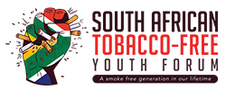
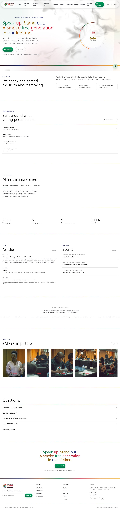
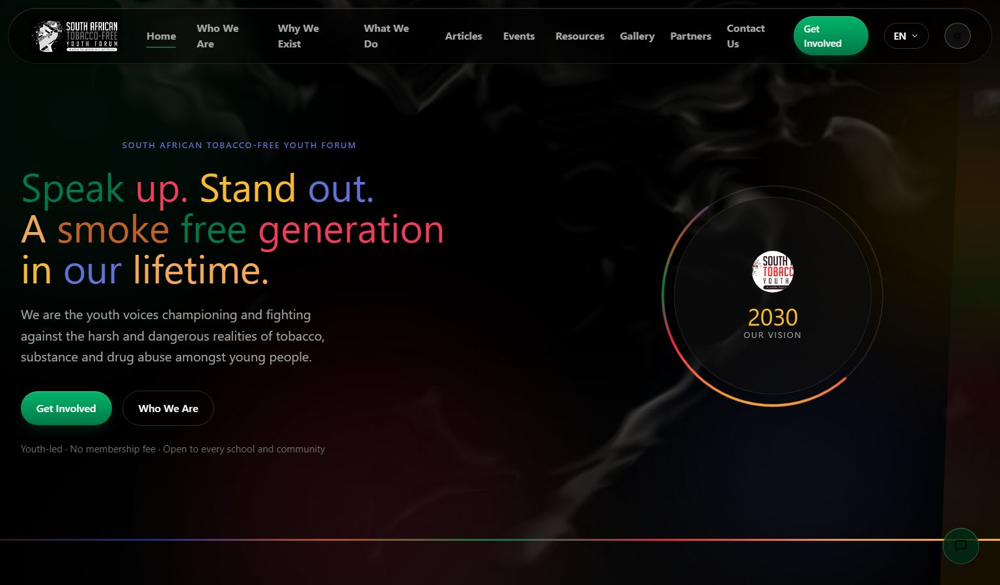
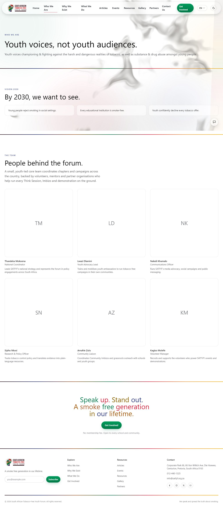
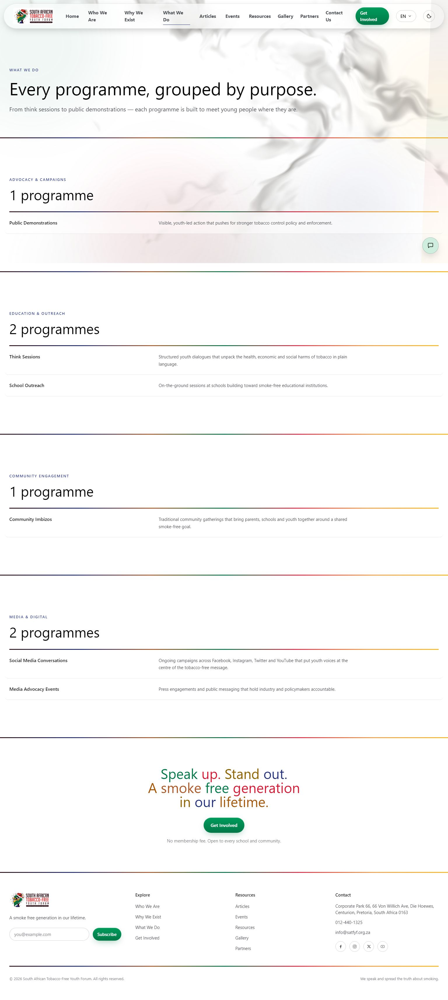
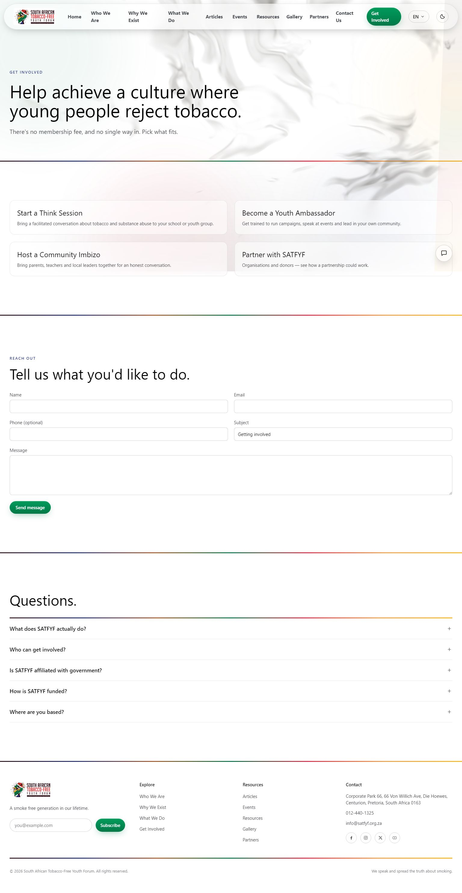
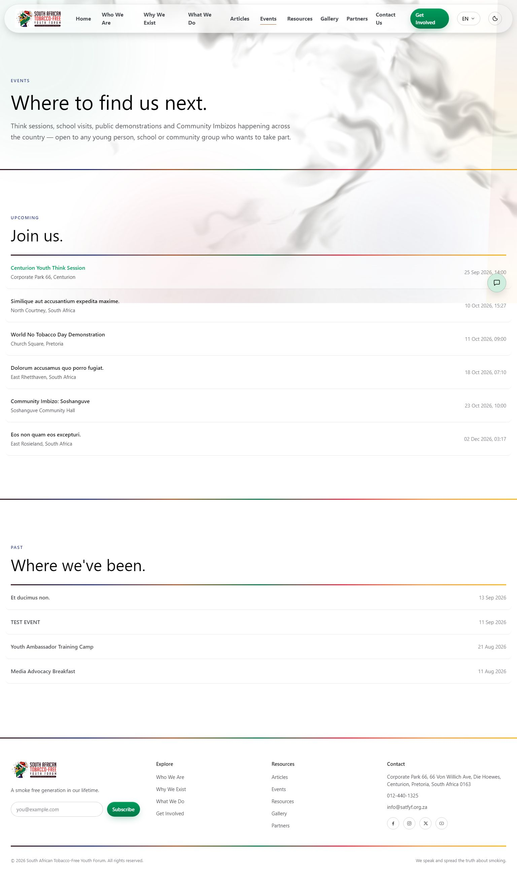
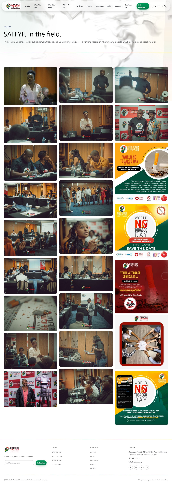
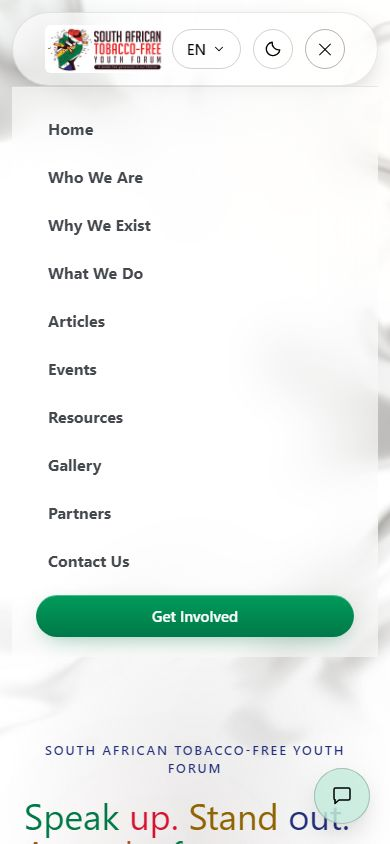

<p align="center">
  
</p>

<h1 align="center">South African Tobacco-Free Youth Forum</h1>

<p align="center">
  A youth-led advocacy website built to recruit, inform and mobilise young people against tobacco, substance and drug abuse across South Africa.
</p>

---

## Contents

- [About](#about)
- [Screenshots](#screenshots)
- [Features](#features)
- [Design system](#design-system)
- [Tech stack](#tech-stack)
- [Project structure](#project-structure)
- [Getting started](#getting-started)
- [Testing & code style](#testing--code-style)
- [Deployment](#deployment)

## About

SATFYF (South African Tobacco-Free Youth Forum) is a nonprofit youth movement fighting tobacco, substance and drug abuse in South African schools and communities. This repository is the organisation's public website and content-management backend: a marketing and recruitment site for visitors, and a full admin dashboard the SATFYF team uses to run it day to day — publishing articles, listing events, managing partners and volunteers, and reading contact/newsletter submissions — without ever touching code.

The whole public site is bilingual-ready: content and UI strings are served in **English, isiZulu, Sesotho and Afrikaans**, selectable from a language switcher in the navigation.

## Screenshots

| Home | Home (dark mode) |
| --- | --- |
|  |  |

| Who We Are | What We Do |
| --- | --- |
|  |  |

| Get Involved | Events |
| --- | --- |
|  |  |

| Gallery | Mobile navigation |
| --- | --- |
|  |  |

## Features

**Public site**
- Home, Who We Are, Why We Exist, What We Do, Get Involved, Articles, Events, Resources, Gallery, Partners and Contact pages, all driven by database content rather than hard-coded copy
- Programmes grouped by category (education & outreach, media & digital, advocacy & campaigns, community engagement)
- Articles with rich Markdown bodies, cover images, image galleries and downloadable attachments
- Events with upcoming/past listings and full detail pages
- A downloadable resource library (fact sheets, toolkits, reports) grouped by category
- A partner/collaborator directory grouped by partnership type, plus a scrolling partner marquee on the home page
- FAQ accordions, a newsletter sign-up, and a contact form that lands in the admin inbox
- An AI chat assistant (Claude) for visitor questions, with a per-day message cap so a nonprofit's API budget can't be blown by a traffic spike
- Full i18n: English, isiZulu, Sesotho and Afrikaans, with a persistent language switcher
- Light/dark theme toggle, applied before first paint to avoid a flash of the wrong theme

**Admin dashboard** (`/admin`)
- Session-based authentication guarded by an `admin` middleware
- CRUD management for team members, programmes, articles (with image uploads and a live Markdown preview), events, resources, gallery images, partners and FAQs
- A contact-submissions inbox and a newsletter-subscriber list with CSV export
- A site-settings editor that drives the hero heading/subtext, mission statement, Vision 2030 copy and footer tagline shown on the public site
- Account settings for the logged-in admin (password change)

## Design system

The front end is built from small, reusable Blade components rather than page-specific markup, so the same visual language (glass surfaces, section widths, hero layout, brand colours) is defined once and reused everywhere:

- **Glassmorphism** — a `.glass`/`.glass-float` utility pair (blurred, tinted, translucent surfaces) applied to the nav, footer, cards, chatbot and language switcher, plus a `.glass-row` utility that turns a list row to glass on hover (programme lists, article/event lists, resource downloads)
- **Brand palette** — a seven-colour brand palette (green, yellow, blue, red, orange, brown, dark brown), with every text usage checked against WCAG contrast and shaded/tinted per-theme where the raw brand hex would fail
- **One typeface, site-wide** — Zalando Sans, self-hosted via Bunny Fonts, used for headings, body copy and navigation alike
- **`<x-ui.page-hero>`** — the shared eyebrow + heading + subtext layout used to open every inner page
- **`<x-ui.rainbow-heading>`** — cycles each word of a heading through the brand's WCAG-safe text colours, used on the home hero and the shared closing call-to-action
- **`<x-ui.closing-cta>`** — the single "Get Involved" call-to-action section reused at the bottom of every page that has one
- A hand-written WebGL fluid-smoke shader as a subtle, site-wide animated background layer (paused automatically off-screen or when the tab isn't visible, to keep it cheap)
- Scroll-triggered reveal animations, animated count-up stats, an image slider, and a sticky glass navigation bar that stays pinned as the page scrolls

## Tech stack

| Layer | Choice |
| --- | --- |
| Backend | Laravel 13, PHP 8.3+ |
| Database | PostgreSQL (developed against [Neon](https://neon.tech)) |
| Frontend build | Vite 8, Tailwind CSS v4 |
| Templates | Blade, exclusively anonymous components (`@props`) |
| Fonts | Zalando Sans, self-hosted via `laravel-vite-plugin`'s Bunny Fonts integration |
| Background effects | Hand-written WebGL1 shaders (no third-party libraries) |
| AI chat | Anthropic Claude API |
| Testing | Pest |
| Code style | Laravel Pint |
| CI/CD | GitHub Actions → Azure Web App |

## Project structure

```
app/
  Http/Controllers/          Public page controllers
  Http/Controllers/Admin/    Admin CRUD controllers
  Models/                    Eloquent models (Article, EventItem, Program, Partner, Resource, ...)
  Services/Chat/             Claude chat integration
resources/
  views/pages/               One Blade view per public route
  views/components/          Reusable UI components (ui/, plus nav, footer, chatbot, ...)
  css/app.css                Design tokens, brand palette, glass/animation utilities
  js/modules/                Small, focused JS modules (reveal, count-up, WebGL canvases, nav)
routes/
  web.php                    Public routes
  admin.php                  Admin routes
lang/                        af.json, zu.json, st.json translation files (en is the base string)
```

## Getting started

Requires PHP 8.3+, Composer, Node 20+, and a PostgreSQL database.

```bash
composer install
npm install

cp .env.example .env
php artisan key:generate
# set DB_* and (optionally) ANTHROPIC_API_KEY in .env

php artisan migrate
npm run build   # or `npm run dev` while developing
php artisan serve
```

Or, to run the server, queue listener and Vite dev server together:

```bash
composer run dev
```

## Testing & code style

```bash
php artisan test --compact   # Pest test suite
vendor/bin/pint              # Laravel Pint code style
```

## Deployment

Pushes to `main` build the frontend assets via GitHub Actions (`.github/workflows/main_satfyf.yml`) and deploy to the `satfyf` Azure Web App.
